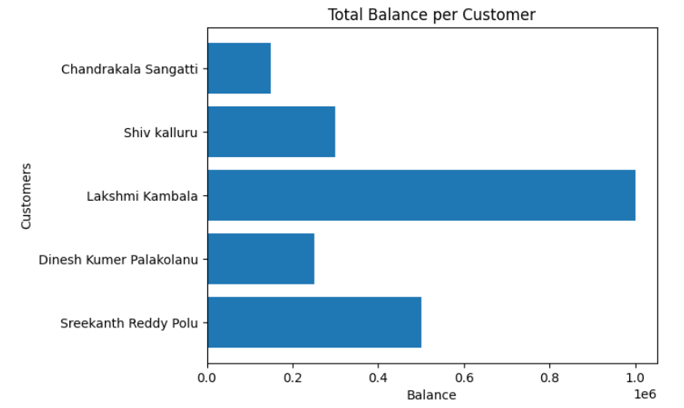
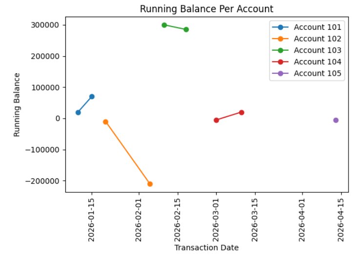

#  Banking Risk & Customer Transaction Analytics Platform (SQL | Python | Power BI)

## Project Overview

This project is a Banking Analytics SQL Project developed using SQL and Python visualization libraries. The project demonstrates database creation, table relationships, data analysis, window functions, aggregate functions, and business analytics queries.

The project is designed to strengthen SQL concepts for Data Analyst and Data Science roles.

SQL queries? check them out here: [SQL_Queries](/Financial_bank_transaction_analysis/)

---

# Database Used

* MySQL

---

# Tables Used

## 1. Customers Table

Stores customer information.

Columns:

* customer_id
* full_name
* age
* city
* gender

---

## 2. Accounts Table

Stores account-related information.

Columns:

* account_id
* customer_id
* account_type
* balance

---

## 3. Transactions Table

Stores transaction records.

Columns:

* transaction_id
* account_id
* transaction_date
* amount
* transaction_type

---

# Project Files

## SQL Files

1. `1_Total_balance_per_customer.sql`
2. `2_The_top_4_customers_with_the_highest_total_account_balance.sql`
3. `3_Monthly_Credit_vs_Debited_amounts.sql`
4. `4_Running_Balance_Per_Account_Window_Function.sql`
5. `5_Number_of_Transactions_Per_Account.sql`
6. `6_total_credit_and_debit_amounts.sql`
7. `7_Identify_Dormant_Accounts_(No_Recent_Transactions).sql`

---

# Key Analysis Performed

Check Visualisation here: [Query Analysis](/Visualisations/)

## 1. Total Balance Per Customer

Calculated the total account balance for each customer.

## 2. Top Customers by Account Balance

Identified customers with the highest balances.

## 3. Monthly Credit vs Debit Analysis

Compared monthly credit and debit transaction amounts.

## 4. Running Balance Calculation

Calculated cumulative running balance using SQL window functions.

## 5. Number of Transactions Per Account

Counted total transactions for each account.

## 6. Total Credit and Debit Amounts

Calculated overall credit and debit transaction totals.

## 7. Dormant Account Identification

Identified accounts with no recent transactions.

---

# Data Visualization

Python Matplotlib library was used to create:

* Bar Charts
* Line Charts
* Pie Charts
* Horizontal Bar Charts

---

# Tools and Technologies Used

* MySQL
* Python
* Pandas
* Matplotlib
* Google Colab
* GitHub

---

# Learning Outcomes

Through this project, I learned:

- To design a normalized relational database with customers, accounts, and transactions.
- To write complex SQL queries using JOINs, aggregations, and CTEs.
- To apply window functions to rank customers and calculate running balances.
- To perform monthly transaction trend analysis and identify dormant accounts.
  
---

# Future Improvements

* Add more advanced SQL queries
* Create interactive dashboards
* Use Power BI or Tableau for visualization
* Add stored procedures and triggers
* Add SQL optimization techniques

---

# Conclusion

This project demonstrates the use of SQL and Python for analyzing banking transaction data. It covers database design, data analysis, window functions, and data visualization to generate meaningful insights such as customer balances, transaction trends, and dormant accounts. The project helped strengthen my SQL, analytical, and data visualization skills through real-world banking analytics scenarios.

---
